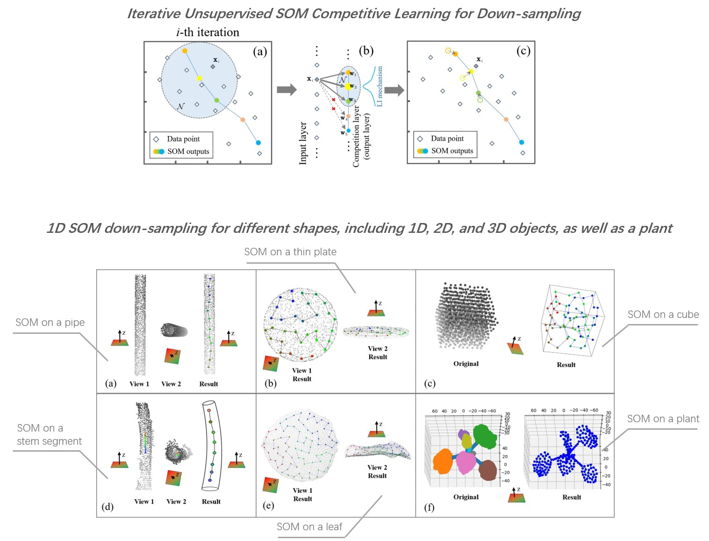

# SOM-down-sampling-for-plant-point-clouds
This repo contains the official codes for our paper:

### Unsupervised shape-aware SOM down-sampling for plant point clouds
[Dawei Li](https://davidleepp.github.io/)<sup>[†](#myfootnote1)</sup>, Zhaoyi Zhou<sup>[†](#myfootnote1)</sup>, and Yongchang Wei

<a name="myfootnote1">†</a> _Equal contribution_

Published on _ISPRS Journal of Photogrammetry and Remote Sensing_ in 2024

[[Paper](https://doi.org/10.1016/j.isprsjprs.2024.03.024)]
___

## Acknowledgement
Part of our code was descended and modified from the open-source code by N. Chebrolu, F. Magistri, T. La¨be, and C. Stachniss (University of Bonn). Their original code can be found at:  https://github.com/PRBonn/4d_plant_registration.

Their related paper is as follows:
N. Chebrolu, F. Magistri, T. La¨be, and C. Stachniss, (2021) Registration of spatio-temporal point clouds of plants for phenotyping. PLoS ONE 16(2):e0247243. https://doi.org/10.1371/journal.pone.0247243

## Prerequisites
- Python == 3.10   
- Numpy == 1.24.4
- opnen3d == 0.18.0

## Introduction
Observation of the external 3D shape/structure and some measurable phenotypic traits is of great significance to screening excellent varieties and improving crop yield in agriculture. The dense crop point clouds scanned by 3D sensors not only may include imaging noise, but also contain a large number of redundant points that will put high burden on storage and slow down the speed of algorithm for point cloud segmentation, classification, and other following processing steps.   
  
To reduce the complexity of point cloud data and meanwhile better represent the structure under limited resources, this paper presents a new Self-organizing Map (SOM)-based down-sampling strategy that is tailored for plant (or plant-like) point clouds. Our SOM-based sampling works in a purely unsupervised manner and precisely controls the number of points after down-sampling. It obtains shape-aware sampling on irregular plant point clouds by automatically encoding preliminary semantics to different organ types (e.g., stems are sampled as “lines”, and leaves are sampled as folded curved shapes in “surfaces”).   
  
Extensive experiments on a multi-species plant dataset were conducted using several popular deep 3D-segmentation networks as the downstream task unit, respectively. The segmentation performance of the SOM-processed dataset outperformed several other mainstream down-sampling strategies. Our SOM strategy with 1D neuron layer can be further generalized to 2D and 3D versions, and also can be extended to a more adaptive framework that automatically picks the most suitable version of SOM for each corresponding local shape component. The proposed strategy also showed good potential in serving different applications including point cloud skeleton extraction, crop main stem length measurement; and presented satisfactory results on point cloud datasets from other domains, indicating its high applicability and good data domain adaptation.



## Quick Start
The main open-source project can be divided into 4 folders, each folder corresponds to an different algorithm in our paper.  
folder [Algorithm1_1D_SOM] corresponds to Algorithm 1 in the paper,   
folder [Algorithm2_2D_SOM] corresponds to Algorithm 2 in the paper,  
folder [Algorithm3_3D_SOM] corresponds to Algorithm 3 in the paper, and  
folder [Algorithm4_Adaptive] corresponds to Algorithm 4 in the paper. 
Partial source data from the paper provided in the folder [./source_data] 
### 1. Algorithm 1
Improved 1D SOM for point set down-sampling runs on cpu mode.
- The ```SOM1D_Plant_data_making.py``` is the entry codes for point set down-sampling.
- The ```som1D.py``` defines the model of 1D SOM.
- ```utils1D.py``` contains all corresponding utilities.
- The ```./data``` folder stores the data for down-sampling.
- The sampled results are saved in ```./output```
Run the demo by following these steps
```
cd Algorithm1_1D_SOM
python SOM1D_Plant_data_making.py
```
If everything goes well, you will see the following messages shown in your bash
```
Savepath: ./output/benthi_control_A_D18_centre_filter.txt
Valid cluster number:  501
Do refinement operation
Number of effective clusters after refinement operation 510
The shape after sampling: (512, 4)
Save successfully
```
### 2. Algorithm 2
2D SOM for 2D-shape point set down-sampling runs on cpu mode.
- The ```SOM2D_Plant_data_making.py``` is the entry codes for point set down-sampling.
- The ```som2D.py``` defines the model of 2D SOM.
- ```utils2D.py``` contains all corresponding utilities.
- The ```./data``` folder stores the data for down-sampling.
- The sampled results are saved in ```./output```
Run the demo by following these steps
```
cd Algorithm2_2D_SOM
python SOM2D_Plant_data_making.py
```
If everything goes well, you will see the following messages shown in your bash
```
Savepath: ./output/leaf_plate.txt
AssignNum: [81]
The shape after sampling: (81, 3)
Save successfully
```
### 3. Algorithm 3
 3D SOM for 3D solid object down-sampling runs on cpu mode.
- The ```SOM3D_Plant_data_making.py``` is the entry codes for point set down-sampling.
- The ```som3D.py``` defines the model of 3D SOM.
- ```utils3D.py``` contains all corresponding utilities.
- The ```./data``` folder stores the data for down-sampling.
- The sampled results are saved in ```./output```
Run the demo by following these steps
```
cd Algorithm3_3D_SOM
python SOM3D_Plant_data_making.py
```
If everything goes well, you will see the following messages shown in your bash
```
Savepath: ./output/solid_cube.txt
AssignNum: [125]
The shape after sampling: (125, 3)
Savepath ./output/solid_cube.txt
Save successfully
```

### 4. Algorithm 4
 Adaptive SOM for point set down-sampling runs on cpu mode.
- The ```PCA_soft_send.py``` is the filtering codes.
- The ```DBSCAN.py``` is the clustering codes.
- The ```Adaptive_SOM.py``` is the adaptive shape-aware down-sampling codes.
- The ```./data``` folder stores the data for shape filtering.
- The ```./filter_out``` folder stores the filtered data for clustering.
- The ```./cluster_out``` folder stores the clustered data for adaptive shape-aware down-sampling.
- The sampled results are saved in ```./output```
Run the demo by following these steps
```
cd Algorithm4_Adaptive
python PCA_soft_send.py
python DBSCAN.py
python Adaptive_SOM.py
```
## TODO List <a name="todos"></a>
- [ ] [Long-term] Acceleration code running on GPU
- [x] Code & data initialization

## Citation
Please consider citing our paper if the project helps your research with the following BibTex:
```
@article{LI2024172,
title = {Unsupervised shape-aware SOM down-sampling for plant point clouds},
journal = {ISPRS Journal of Photogrammetry and Remote Sensing},
author = {Dawei Li and Zhaoyi Zhou and Yongchang Wei},
volume = {211},
pages = {172-207},
year = {2024},
issn = {0924-2716},
doi = {https://doi.org/10.1016/j.isprsjprs.2024.03.024}
}
```
